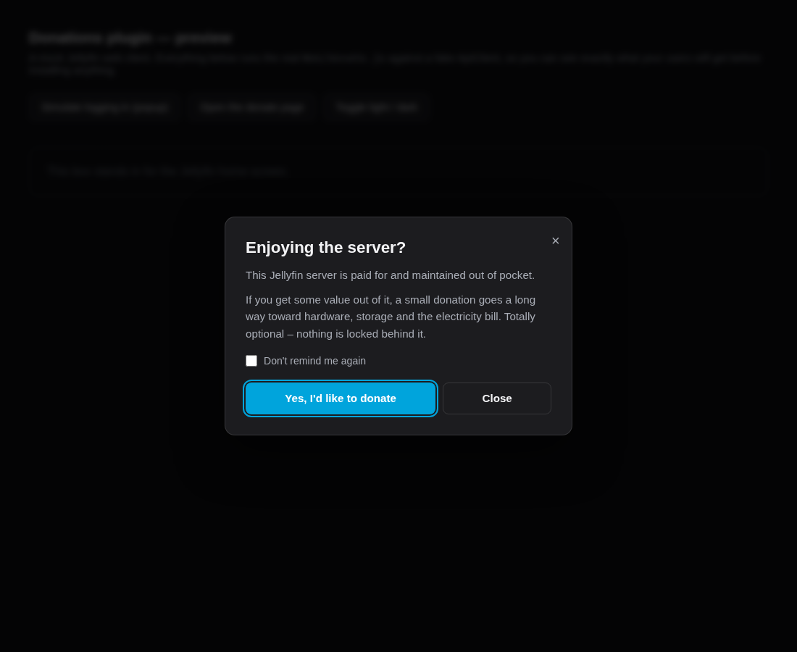

# Jellyfin Donations plugin

Asks your users, when they log in, whether they'd like to donate to whoever pays for the
server — with a donate page listing the payment methods you configure, a per-user
**"Don't remind me again"** option, and a thank-you message.



## What users see

1. A few seconds after logging in, a popup appears: your title, your message, a
   **donate** button and a **close** button, plus an optional *Don't remind me again*
   checkbox.
2. **Donate** opens the donate page — a card per payment method, each with a link, a
   copy-to-clipboard handle, optional instructions, and an optional QR-code image.
3. Once they open a method or copy a handle, the **thank-you message** appears, along
   with an *I've made a donation* button that stops future reminders.
4. **Close** just dismisses it. Ticking *Don't remind me again* first records the opt-out
   on the server, so it follows them to every device they use.

## Requirements

- Jellyfin server **10.10.x** (built against 10.10.7, `net8.0`)
- The **web client** — the popup is a browser thing. Native apps (Android TV, Roku,
  Infuse, …) don't run web-client scripts, so those users won't see it. The `Donate/*`
  API endpoints still work everywhere.

## Building

Needs the .NET 8 SDK (`sudo pacman -S dotnet-sdk-8.0` on Arch, or
`curl -fsSL https://dot.net/v1/dotnet-install.sh | bash -s -- --channel 8.0`).

```bash
./build.sh              # -> dist/Jellyfin.Plugin.Donate_1.0.0.0.zip
./build.sh --install    # also copies it into a local Jellyfin plugin directory
```

## Installing

Unzip `Jellyfin.Plugin.Donate.dll` and `meta.json` into a folder called `Donations_1.0.0.0`
inside your Jellyfin plugin directory, then restart the server:

| Setup | Plugin directory |
| --- | --- |
| Package install (Linux) | `/var/lib/jellyfin/plugins` |
| Docker (linuxserver, official) | `/config/plugins` |
| Manual / portable | `<data dir>/plugins` |

Then go to **Dashboard → Plugins → Donations** to configure it.

After installing or changing settings, users need a **hard refresh** (Ctrl+Shift+R) —
the browser caches the web client's `index.html`.

## How the popup gets into the web client

Jellyfin has no supported hook for adding scripts to its web UI, so — like Jellyscrub
and other UI plugins — this one patches a single tagged `<script>` tag into the web
client's `index.html` on startup and whenever you save settings:

```html
<script plugin="Jellyfin.Plugin.Donate" version="1.0.0.0" src="Donate/ClientScript?v=1.0.0.0" defer></script>
```

The tag is stripped and rewritten every time, so it never duplicates, and a server or
web-client upgrade that resets `index.html` just gets it re-applied on the next restart.
Turning **"Add the popup script automatically"** off removes it again cleanly.

**If the web root is read-only** (some Docker setups, or a reverse proxy serving its own
copy of the web client), the plugin logs a warning and does nothing else. Add the tag to
your `index.html` yourself and leave the auto-inject option off.

## "I installed it and nothing happens"

Open **Dashboard → Plugins → Donations**. The **Status** panel at the top says whether the
popup is live and, if not, exactly what is missing. The two **Preview** buttons show you
the popup and the donate page immediately, ignoring the rules below.

The three usual causes:

1. **No payment method is enabled.** The presets ship switched off, and the popup stays
   hidden until at least one is enabled (or an external donate URL is set) — it won't send
   people to an empty page. Enable one under *Payment methods* and save.
2. **You're an administrator.** *Also show the popup to administrators* is off by default,
   since the admin is usually the person being donated to. Tick it while testing, or use
   the Preview buttons.
3. **The script isn't in the web client yet.** It's added at server startup, so restart
   Jellyfin after installing, then **hard refresh** the browser (Ctrl+Shift+R). The Status
   panel reports whether the script is installed and whether the file is writable.

## Reaching the donate page

Three ways in, independent of the popup:

- the **Donate** entry in the sidebar menu (on by default)
- the floating **Donate** button in the corner (on by default)
- `JellyfinDonate.open()` from the console, or any element with a `data-jf-donate`
  attribute / `<a href="#donate">`

Both the menu entry and the floating button can be turned off under *Appearance*.

## Settings

**Login popup** — enable/disable, title, message, both button labels, the *Don't remind me
again* checkbox and its label, how many seconds to wait after login, whether to prompt
admins, and a **minimum days between reminders** (`0` = once per browser session, i.e.
roughly every time someone opens Jellyfin; `30` = at most monthly).

**Donate page** — title, message, thank-you message, the *I've donated* button label, and
an optional **external URL** to send people to your own page (Ko-fi, GitHub Sponsors, …)
instead of the built-in page.

**Payment methods** — add as many as you like. Presets are included for PayPal, Venmo,
Cash App, Interac e-Transfer, Ko-fi, Buy Me a Coffee, GitHub Sponsors, Patreon, Revolut,
Wise, bank transfer and Bitcoin. Each card has:

| Field | Notes |
| --- | --- |
| Name | Card heading |
| Link | Optional. Omit it for methods with no URL, like Interac e-Transfer |
| Handle / address | Optional. Shown with a **Copy** button — the e-mail, `@handle` or `$cashtag` |
| Instructions | Optional free text, e.g. *"Auto-deposit is on, no security question"* |
| Icon | 1–2 characters or an emoji |
| Accent colour | Any CSS colour |
| Image / QR URL | Optional. `https://` or a `data:image/...` URI — good for payment QR codes |

A method needs a link **or** a handle to be shown. If no method is enabled, the popup
stays hidden — the plugin won't nag people toward an empty page.

**Appearance** — colour scheme (auto / dark / light), accent colour, the sidebar *Donate*
entry and the floating *Donate* button (both on by default), the label used for them, and
an *Allow HTML in messages* switch (off by default; messages render as plain text, blank
lines become paragraphs).

**User reminders** — shows how many users opted out or marked themselves as donors, with a
button to reset all of it.

## API

| Endpoint | Auth | Purpose |
| --- | --- | --- |
| `GET /Donate/ClientScript` | anonymous | The injected script |
| `GET /Donate/Config` | user | Settings + this user's reminder state |
| `POST /Donate/Prompted` | user | Records that the popup was shown |
| `POST /Donate/OptOut` | user | `{"OptOut": true}` — don't remind me again |
| `POST /Donate/Donated` | user | Marks the user as having donated |
| `GET /Donate/Status` | admin | Diagnostics behind the Status panel |

From the browser console, `JellyfinDonate.open()` opens the donate page any time, and
anything with a `data-jf-donate` attribute (or `<a href="#donate">`) does the same when
clicked. Set `window.JFD_DEBUG = true` for logging.

Per-user state lives in the plugin configuration XML. That's fine for a normal family/
friends server; it isn't built for tens of thousands of users.

## Previewing without installing

`preview.html` runs the real `Web/donate.js` against a fake `ApiClient`, so you can see
and tweak exactly what users get:

```bash
xdg-open preview.html                # popup
xdg-open 'preview.html?page'         # donate page
xdg-open 'preview.html?thanks&light' # thank-you message, light scheme
```

Edit the `mockConfig` object at the top of the file to try your own wording and methods.

## Layout

```
Jellyfin.Plugin.Donate/
├── Plugin.cs                       plugin registration + config page
├── PluginServiceRegistrator.cs     DI registration
├── Api/DonateController.cs         the endpoints above
├── Api/Models.cs                   DTOs sent to the browser
├── Configuration/                  settings classes + the admin page
├── Services/DonationStore.cs       per-user state + "should we prompt?" logic
├── Services/ScriptInjectionService.cs   index.html patching
└── Web/donate.js                   the popup, donate page and thank-you message
```
